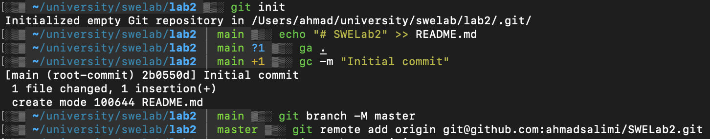
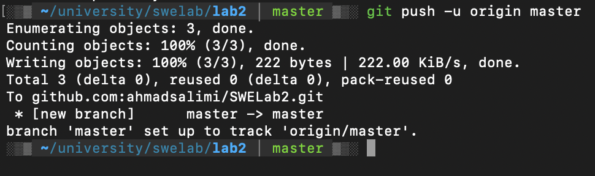
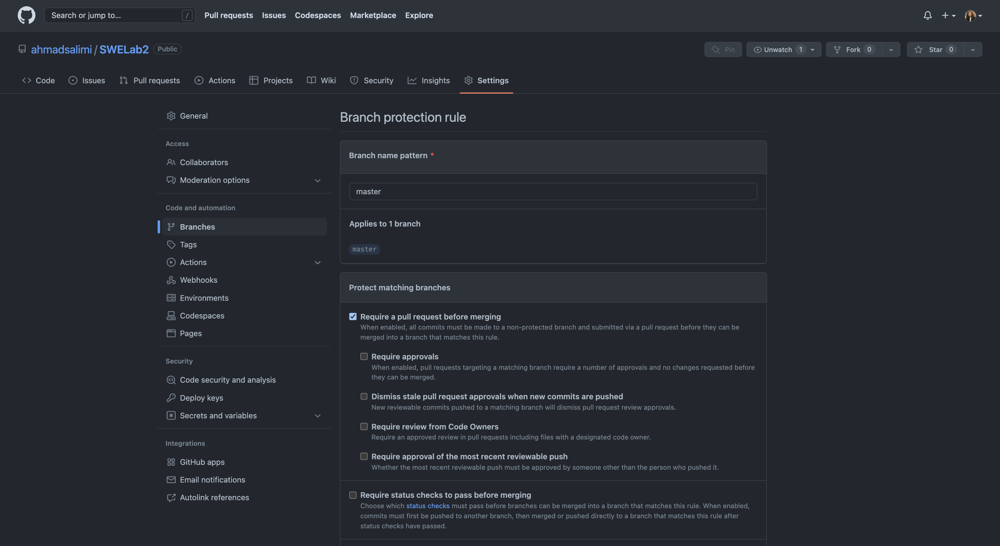
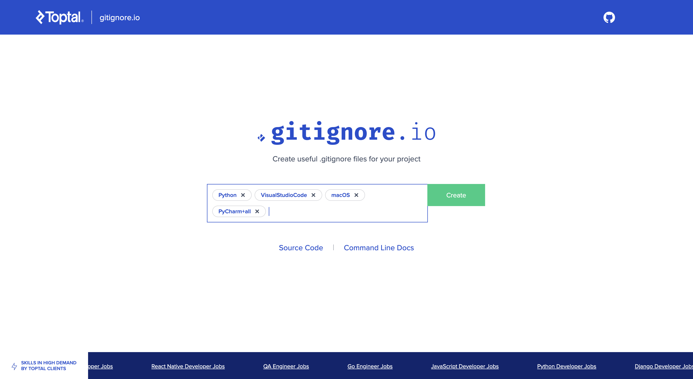
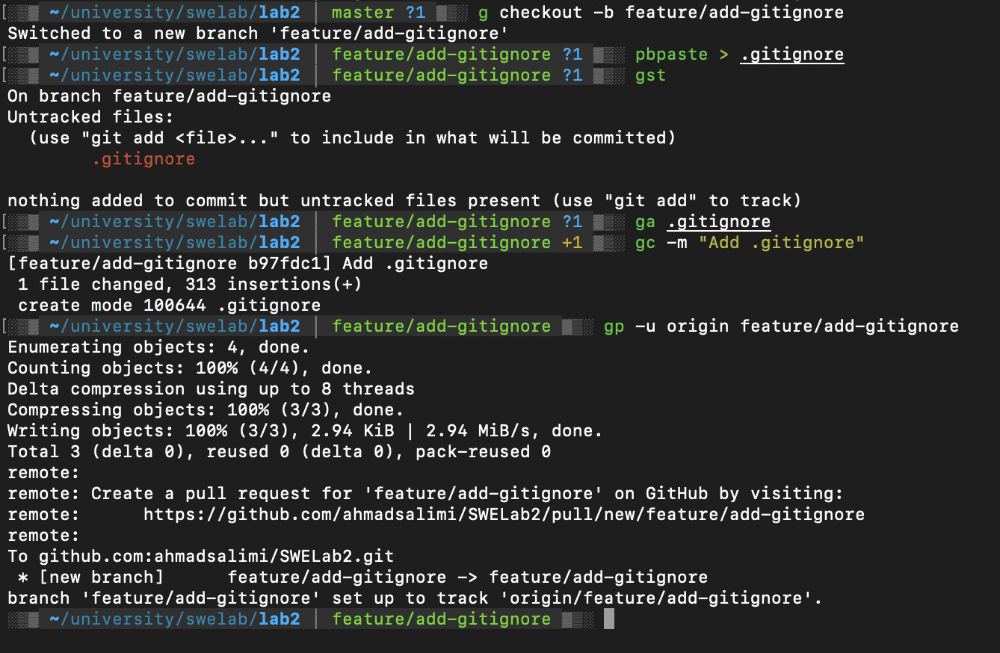
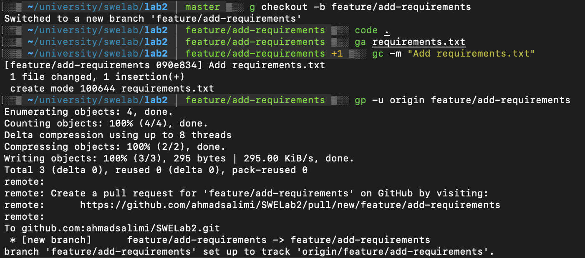
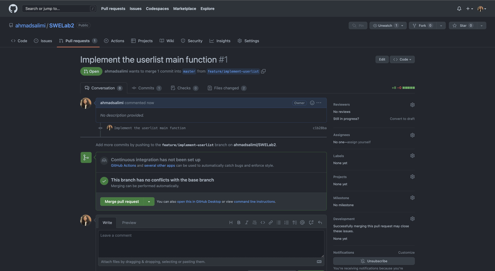
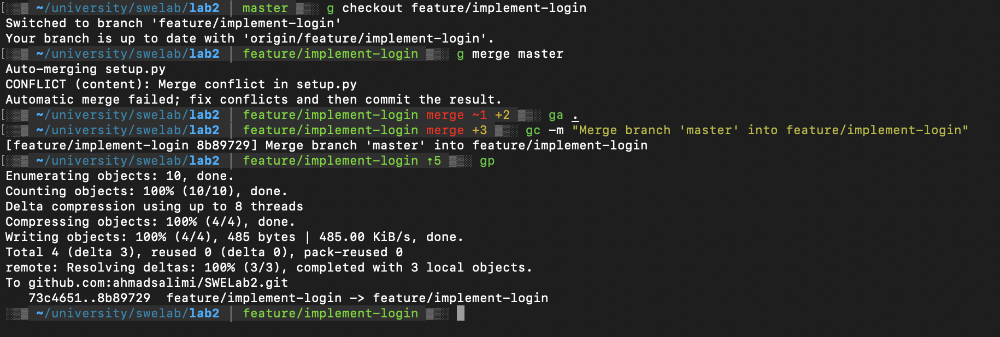
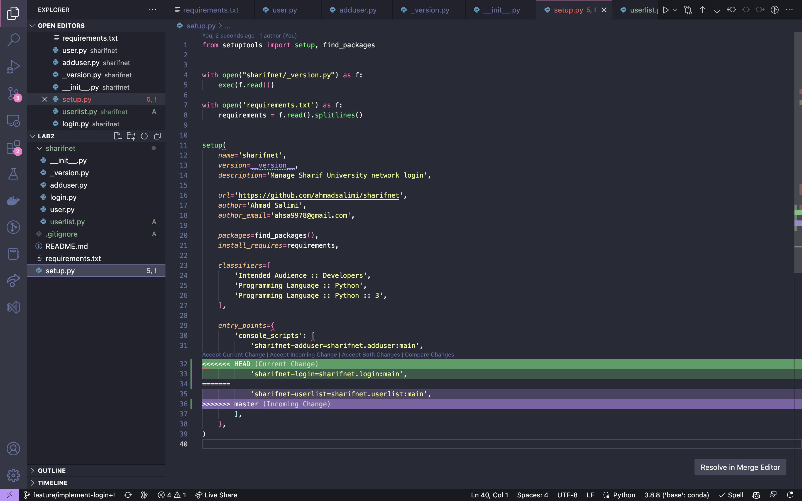
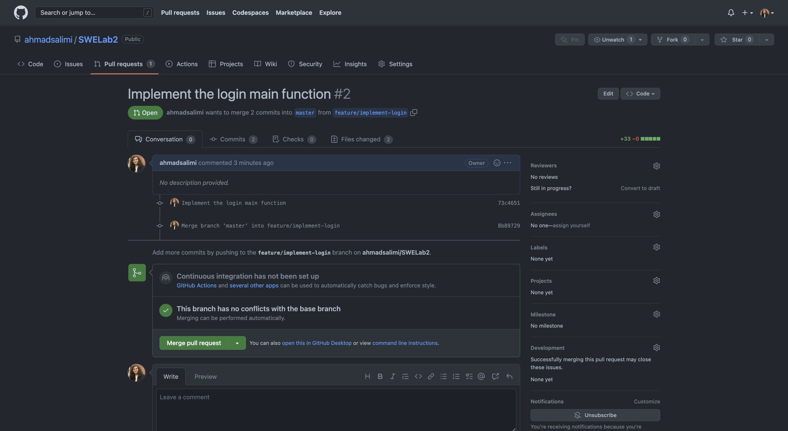

# Sharifnet

A CLI tools to manage SUT network users and login to the network.

## Git Commands

## Project Initialization




## Protecting the `master` branch



## Creating the `.gitignore` file



## Adding the `.gitignore` file to a new feature branch



## Adding the `requirements.txt` file to a new feature branch



## Create a pull request



## Create a pull request with a merge conflict


## Resolve the merge conflict and merge the pull request





# Answers to questions

1. `.git` directory is a hidden folder in a Git repository that stores all the metadata and objects that are necessary to version control a project. The information stored in this directory includes:

    - Object database: This contains all the snapshots of the repository's contents at various points in time.
    - Index: This file tracks the current state of the repository and helps to manage the staging area between the working directory and the repository.
    - HEAD: This file points to the branch that is currently checked out in the repository.
    - Configuration files: These files store repository-level and user-level configurations, such as the location of the remote repository and user name and email.
    - Hooks: These are scripts that can be executed automatically when certain Git events occur, such as committing changes or updating the repository.
    - Refs: These are pointers to various objects in the Git object database, such as branches, tags, and remotes.

1. Atomicity in Git refers to the idea that each commit or pull request is treated as an indivisible, self-contained change to the repository. This means that each commit should represent a single, complete change to the codebase that can be easily understood and managed in isolation from other changes.

    In practice, this means that each commit should be small and focused, containing only the changes necessary to implement a specific feature or fix a specific bug. This makes it easier to track the history of the codebase, revert changes if necessary, and collaborate with other developers on a shared repository.

    Similarly, in the context of pull requests, atomicity refers to the idea that each pull request should represent a single, well-defined change to the codebase. This makes it easier to review and merge changes, and ensures that the repository remains in a stable state at all times.

1. In Git, `fetch`, `pull`, and `merge` are all operations used to integrate changes from a remote repository into a local repository. However, they each have different purposes and behaviors:

    - Fetch: `fetch` is used to download data from a remote repository, but it does not automatically integrate those changes into the local repository. Instead, it updates the local repository with the latest state of the remote repository, including information about new branches and changes to existing branches. After a fetch operation, the changes can be reviewed using Git tools like git log and git diff.

        Example:

        ```bash
        git fetch origin
        ```
    
    - Pull: `pull` combines a fetch operation with an automatic merge of the changes into the local repository. This means that after a pull operation, the local repository will have all the latest changes from the remote repository, including any new branches and changes to existing branches.

        Example:

        ```bash
        git pull origin master
        ```

    - Merge: `merge` is used to integrate changes from one branch into another. For example, if you have made changes in your local branch and want to merge those changes into the master branch, you can use the git merge command. Merging can result in conflicts if there are conflicting changes between the two branches, which need to be resolved before the merge can be completed.

        Example:

        ```bash
        git checkout master
        git merge feature-branch
        ```
    
    In general, pull is the most convenient way to integrate changes from a remote repository into a local repository, as it performs both a fetch and a merge in one step. However, if you need more control over the integration process, or if you want to review changes before merging them, you can use fetch followed by a separate merge operation.