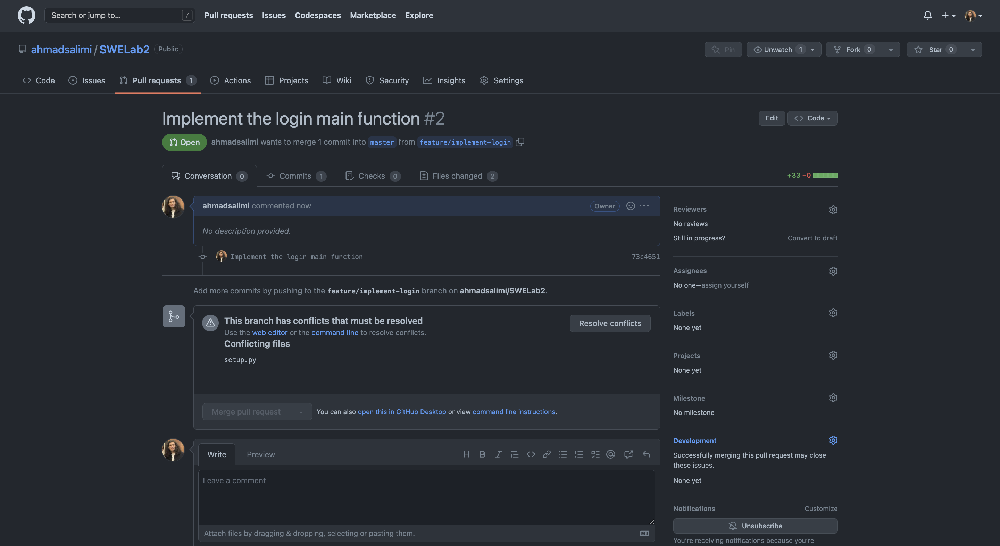

# Sharifnet

A CLI tools to manage SUT network users and login to the network.

## Git Commands

## Project Initialization


## Protecting the `master` branch


## Creating the `.gitignore` file


## Adding the `.gitignore` file to a new feature branch


## Adding the `requirements.txt` file to a new feature branch


## Create a pull request


## Create a pull request with a merge conflict



## Resolve the merge conflict and merge the pull request


# Answers to questions

1. `.git` directory is a hidden folder in a Git repository that stores all the metadata and objects that are necessary to version control a project. The information stored in this directory includes:

    - Object database: This contains all the snapshots of the repository's contents at various points in time.
    - Index: This file tracks the current state of the repository and helps to manage the staging area between the working directory and the repository.
    - HEAD: This file points to the branch that is currently checked out in the repository.
    - Configuration files: These files store repository-level and user-level configurations, such as the location of the remote repository and user name and email.
    - Hooks: These are scripts that can be executed automatically when certain Git events occur, such as committing changes or updating the repository.
    - Refs: These are pointers to various objects in the Git object database, such as branches, tags, and remotes.

1. Atomicity in Git refers to the idea that each commit or pull request is treated as an indivisible, self-contained change to the repository. This means that each commit should represent a single, complete change to the codebase that can be easily understood and managed in isolation from other changes.

    In practice, this means that each commit should be small and focused, containing only the changes necessary to implement a specific feature or fix a specific bug. This makes it easier to track the history of the codebase, revert changes if necessary, and collaborate with other developers on a shared repository.

    Similarly, in the context of pull requests, atomicity refers to the idea that each pull request should represent a single, well-defined change to the codebase. This makes it easier to review and merge changes, and ensures that the repository remains in a stable state at all times.

1. In Git, `fetch`, `pull`, and `merge` are all operations used to integrate changes from a remote repository into a local repository. However, they each have different purposes and behaviors:

    - Fetch: `fetch` is used to download data from a remote repository, but it does not automatically integrate those changes into the local repository. Instead, it updates the local repository with the latest state of the remote repository, including information about new branches and changes to existing branches. After a fetch operation, the changes can be reviewed using Git tools like git log and git diff.

        Example:

        ```bash
        git fetch origin
        ```
    
    - Pull: `pull` combines a fetch operation with an automatic merge of the changes into the local repository. This means that after a pull operation, the local repository will have all the latest changes from the remote repository, including any new branches and changes to existing branches.

        Example:

        ```bash
        git pull origin master
        ```

    - Merge: `merge` is used to integrate changes from one branch into another. For example, if you have made changes in your local branch and want to merge those changes into the master branch, you can use the git merge command. Merging can result in conflicts if there are conflicting changes between the two branches, which need to be resolved before the merge can be completed.

        Example:

        ```bash
        git checkout master
        git merge feature-branch
        ```
    
    In general, pull is the most convenient way to integrate changes from a remote repository into a local repository, as it performs both a fetch and a merge in one step. However, if you need more control over the integration process, or if you want to review changes before merging them, you can use fetch followed by a separate merge operation.

1. In Git, clone and rebase are two distinct operations that serve different purposes:

    - Clone: `clone` is used to create a local copy of a remote repository. This is typically done when you want to start working on a project that is hosted on a remote Git server, or when you want to create a backup of a remote repository on your own computer. The clone operation will download all the data and history of the remote repository, including all the branches and tags, and create a new local repository with the same content.

        Example:

        ```bash
        git clone https://github.com/user/repo.git
        ```

    - Rebase: `rebase` is used to reapply a series of commits from one branch onto another branch. The rebase operation will "move" the branch pointer to the specified branch and reapply each commit from the original branch on top of the new branch. This can be used to keep a feature branch up-to-date with the latest changes in the master branch, for example. Rebase can result in conflicts if there are conflicting changes between the two branches, which need to be resolved before the rebase can be completed.

        Example:

        ```bash
        git checkout feature-branch
        git rebase master
        ```

1. In Git, reset and revert are two operations used to undo changes in a repository, but they have different behaviors and consequences:

    - Reset: `reset` is used to move the branch pointer to a specific commit and discard any changes made since that commit. This operation is used to "undo" a series of one or more commits, effectively "rolling back" the repository to a previous state. When you reset a branch, the branch pointer is moved to the specified commit, and the changes made in any subsequent commits are discarded. The discarded changes are not lost permanently, but they are not accessible from any branch and must be recovered using Git tools like `git reflog` or `git stash`.

        Example:

        ```bash
        git reset --hard HEAD~2
        ```

    - Revert: `revert` is used to undo a specific commit by creating a new commit that "undoes" the changes made in the original commit. When you revert a commit, Git creates a new commit that reverts the changes made in the original commit, effectively "cancelling" the original change. Unlike `reset`, the changes made in the original commit are not discarded, but are still available in the repository history.

        Example:

        ```bash
        git revert <commit-hash>
        ```

1. In Git, stage and snapshot are two terms that describe different aspects of the Git workflow:

    - Stage: The stage is a term used to describe the process of preparing a set of changes for a commit. When you make changes to a file in your repository, those changes are not automatically part of the next commit. Instead, you need to stage the changes by adding them to the Git index, which is a temporary area where the changes are stored before they are committed. The git add command is used to stage changes.

    - Snapshot: A snapshot is a term used to describe a version of the repository at a specific point in time. When you make a commit in Git, you are creating a new snapshot of the repository that includes all the changes that have been staged. The commit records the changes in the repository history and creates a new "checkpoint" that allows you to revisit the repository state at any time.
